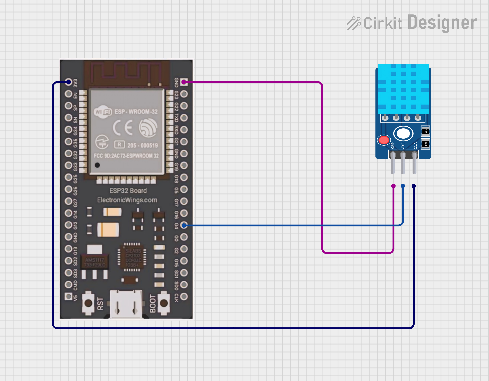

# MicroPython ESP32 DHT11 Web Server

This project is a complete solution for creating a wireless environmental monitoring system using an **ESP32** microcontroller and a **DHT11 sensor**. It leverages the built-in Wi-Fi capabilities of the ESP32 to serve a dynamic web page that displays real-time temperature and humidity data. The web interface is designed to be user-friendly and automatically refreshes, providing an up-to-the-minute view of your environment.

***


### ⚙️ How It Works

The system operates on a client-server model:

1.  **Wi-Fi Connection**: The ESP32 is programmed to act as a **Wi-Fi station (STA)**, connecting to your local network using a specified SSID and password.
2.  **Web Server**: Once connected, the ESP32 creates a web server on **port 80**. It listens for incoming HTTP requests from any device on the same network.
3.  **Sensor Reading**: When a request is received, the ESP32 reads the temperature and humidity from the DHT11 sensor.
4.  **Dynamic Web Page**: The microcontroller then generates an **HTML web page** on the fly. It embeds the current sensor readings directly into the HTML code.
5.  **Response & Auto-Refresh**: The ESP32 sends the generated HTML back to the client's web browser. The HTML includes a meta tag that instructs the browser to reload the page every 3 seconds, ensuring the data is always current.
6.  **Error Handling**: The code includes a `try-except` block to manage potential sensor reading failures or network issues, preventing the program from crashing and making it more robust.

***

### 🧱 Components and Connections

You will need the following components to assemble this project:

* **ESP32 Development Board** 🧠
* **DHT11 Temperature and Humidity Sensor** 💧🌡️
* **Breadboard** (optional, but recommended)
* **Jumper Wires**
* **Micro-USB Cable** for power and data transfer
---

#### Circuit Diagram




The wiring is straightforward. The DHT11 sensor has three pins: VCC, GND, and a data pin.

| DHT11 Pin | ESP32 Pin | Connection Type |
| :-------- | :-------- | :-------------- |
| **VCC** | **3.3V** | Power |
| **GND** | **GND** | Ground |
| **Data** | **GPIO4** | Data Signal |


***

### 🖥️ Software Setup

1.  **Install MicroPython Firmware**: Before you can upload the code, you must flash the MicroPython firmware onto your ESP32. Detailed instructions can be found on the [official MicroPython downloads page](https://micropython.org/download/esp32/). We recommend using **Thonny IDE**, which simplifies the process of flashing firmware and uploading code.
2.  **Upload the Code**: Save the provided code as `main.py` and upload it to your ESP32's filesystem using Thonny. The ESP32 automatically executes the `main.py` file on startup.
3.  **Configure Wi-Fi**: Open the `main.py` file and update the `SSID` and `PASSWORD` variables with your local Wi-Fi network credentials.

    ```python
    SSID = "your_network_name"
    PASSWORD = "your_network_password"
    ```

***


### 🚀 Usage

1.  **Power On**: Connect your ESP32 to a power source using the Micro-USB cable.
2.  **Find the IP Address**: The ESP32 will connect to your Wi-Fi network and print its assigned IP address in the serial console (e.g., Thonny's shell).
3.  **Access the Web Server**: Open a web browser on any device connected to the same network and enter the IP address. The web page will load, displaying the live temperature and humidity data. The `meta refresh` tag will ensure the page updates automatically every 3 seconds.

***
### ✨ A Message for Students

This project is more than just code and wires; it's your first step into the incredible world of the **Internet of Things (IoT)**. You've built a device that connects the physical world (temperature and humidity) to the digital world (a web page).

By completing this project, you're not just following instructions—you're becoming a creator. Think of all the amazing things you can build from here: a smart light that turns on when you enter a room, a plant watering system that responds to soil moisture, or a security system that sends you alerts. The possibilities are endless!

If you found this project helpful, give it a star on GitHub! Your support helps others discover and learn. Happy coding!

---


## 👨‍💻 Author

- **Name:** Kritish Mohapatra 
- **GitHub:** [Kritish Mohapatra](https://github.com/kritishmohapatra)
