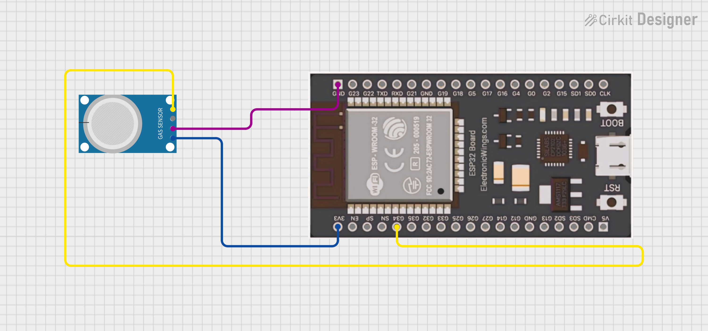
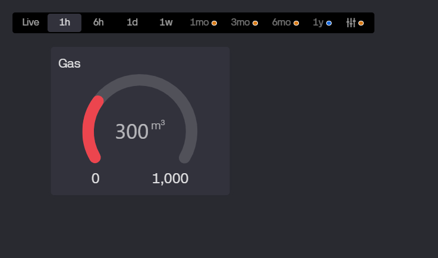

# MicroPython ESP32 MQ-4 Gas Sensor to Blynk IoT Dashboard

This project demonstrates how to connect an **MQ-4 Methane Gas Sensor** to an **ESP32** running MicroPython, read its analog values, and send them to a **Blynk IoT dashboard** using the HTTP API. This allows for remote monitoring of gas levels, ideal for safety applications, environmental sensing, or educational purposes.

***


### ⚙️ How It Works

This system integrates hardware and cloud services to provide real-time gas level monitoring:

1.  **MQ-4 Sensor Reading**: The MQ-4 gas sensor, an analog device, detects methane and other combustible gases. Its output voltage changes proportionally to the gas concentration. The ESP32's **Analog-to-Digital Converter (ADC)** reads this voltage, converting it into a digital value (0-1023 for 10-bit resolution).
2.  **Wi-Fi Connectivity**: The ESP32 connects to a specified Wi-Fi network, enabling internet access.
3.  **Blynk Cloud Integration**: Using the `urequests` library, the ESP32 makes HTTP GET requests to the Blynk Cloud API. These requests include the unique `BLYNK_TOKEN` and the gas sensor's reading, which is then mapped to a designated **Virtual Pin (V0)** on your Blynk dashboard.
4.  **Remote Monitoring**: The Blynk mobile app or web dashboard displays the gas sensor data in real-time using a Gauge widget, allowing you to monitor gas levels from anywhere with an internet connection.
5.  **Resource Management**: `gc.collect()` is used to manage memory efficiently, especially important for long-running MicroPython applications on resource-constrained devices.

***

### 🧱 Components and Connections

To build this project, you will need the following hardware components:

* **ESP32 Development Board** 🧠
* **MQ-4 Methane Gas Sensor Module** 🧯 (Note: This module often includes a heater and basic signal conditioning)
* **Breadboard** (highly recommended for easy assembly)
* **Jumper Wires**
* **Micro-USB Cable** for power and programming

#### Circuit Diagram

The MQ-4 gas sensor module typically has 4 pins: VCC, GND, DO (Digital Out), and AO (Analog Out). For analog readings, we will use the AO pin.

| MQ-4 Pin | ESP32 Pin      | Connection Type      |
| :------- | :------------- | :------------------- |
| **VCC** | **5V** or **3.3V** | Power (check MQ-4 module voltage spec, typically 5V) |
| **GND** | **GND** | Ground               |
| **AO** | **GPIO34** | Analog Input (ADC1_CH6) |
| **DO** | *(Not used in this project for analog reading)* | Digital Output (for threshold alerts) |



**Important Note**: Many MQ-series sensor modules operate optimally at 5V. Ensure your ESP32 board can provide 5V or use an external 5V power supply. If your MQ-4 module has an onboard voltage regulator and is designed for 3.3V input, you can connect VCC to 3.3V. Always check your specific MQ-4 module's datasheet.

***

### 🖥️ Software Setup

1.  **Install MicroPython Firmware**: If your ESP32 isn't already running MicroPython, you'll need to flash the firmware. You can find detailed instructions and the latest firmware on the [official MicroPython downloads page](https://micropython.org/download/esp32/). **Thonny IDE** is an excellent tool for flashing firmware and managing MicroPython files.

2.  **Upload the Code**: Save the provided Python code as `main.py` and upload it to your ESP32's filesystem using Thonny IDE. The `main.py` file is automatically executed when the ESP32 boots.

3.  **Install `urequests` Library**: The `urequests` library is essential for making HTTP requests.
    * In Thonny, go to `Tools > Manage packages...`
    * Search for `micropython-urequests` and install it.
    * Alternatively, you can manually upload the `urequests.py` file to your ESP32's `lib` directory.

4.  **Configure Wi-Fi and Blynk Credentials**: Open the `main.py` file and update the following variables:

    ```python
    SSID = "your_wifi_network_name"       # Your Wi-Fi SSID
    PASSWORD = "your_wifi_password"       # Your Wi-Fi Password

    BLYNK_TOKEN = "YOUR_BLYNK_AUTH_TOKEN" # Your unique Blynk Auth Token
    MQ4_VPIN = "V0"                       # Virtual Pin for MQ-4 data (e.g., V0)
    ```
    * To get your `BLYNK_TOKEN`, create a new project in the Blynk IoT app or web dashboard. The token will be provided in the device info.
    * In your Blynk template, add a **Gauge widget** and assign it to Virtual Pin `V0`. Configure its reading range (e.g., 0 to 1023) to match the sensor's ADC output.

***
### 📊DashBoard



### 🚀 Usage

1.  **Power On**: Connect your ESP32 to a power source using the Micro-USB cable.
2.  **Monitor Serial Output**: Open the serial monitor in Thonny IDE. You will see messages indicating Wi-Fi connection status and the raw MQ-4 gas values along with calculated voltage.
3.  **View on Blynk**: Open your Blynk IoT app or web dashboard. The Gauge widget assigned to `V0` will display the real-time gas sensor readings from your ESP32. Move the MQ-4 sensor near a gas source (e.g., a lighter - briefly and carefully!) to observe changes in the readings.

***

### ✨ A Message for Students

This project is a fantastic introduction to the power of **IoT (Internet of Things)** and **remote monitoring**! You've gone beyond just blinking an LED; you're now connecting a physical sensor to a cloud platform, enabling you to gather real-world data and visualize it from anywhere.

You're learning about:
* **Analog Sensors and ADCs**: How microcontrollers interpret real-world physical phenomena.
* **Networking**: Connecting your device to the internet.
* **Cloud Communication**: Sending data to an online service like Blynk.
* **Data Visualization**: Using dashboards to understand your data.

This foundation is crucial for countless applications, from smart homes and environmental monitoring to industrial automation. Keep experimenting, keep building, and don't hesitate to modify this project to measure other parameters or control devices! The world of embedded systems and IoT is waiting for your innovations.

If you found this project helpful, please consider giving it a star on GitHub! Your support encourages more open-source sharing and learning. Happy innovating!

---

### 👨‍💻 Author

-   **Name:** Kritish Mohapatra
-   **GitHub:** [Kritish Mohapatra](https://github.com/kritishmohapatra)

## ⭐ Like this project?

Give it a ⭐ on GitHub and share with others!