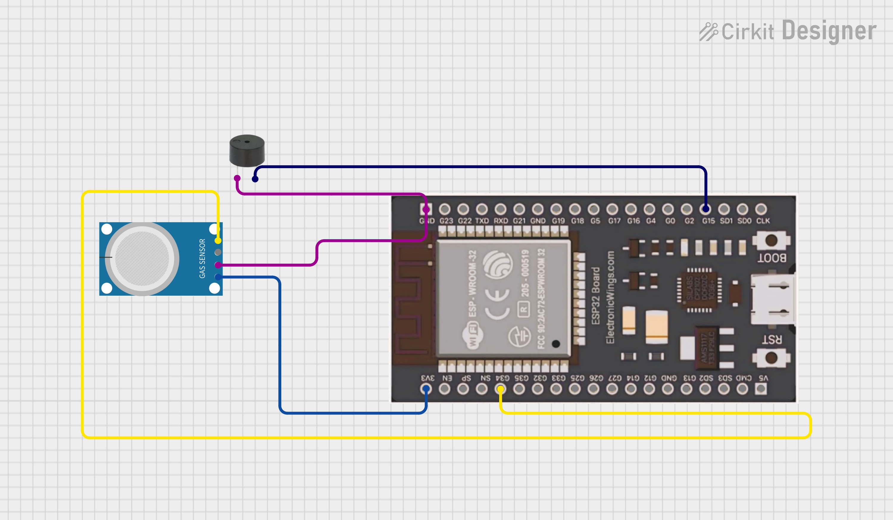

# 🚨 **MQ4 Gas Leak Detection System with ESP32 & MicroPython**

This project uses an **MQ4 gas sensor**, an **ESP32** board, and **MicroPython** to detect **methane (CH4) gas**. When gas concentrations exceed a set threshold, a **buzzer** alerts the user.

---

## 📦 Features

- 🧪 Reads **methane gas levels** from **MQ4 sensor**
- 🔊 **Buzzer alarm** when gas concentration exceeds the threshold
- 🌐 **Real-time data logging** via **Serial Monitor**
- 🔄 **Auto-detection** and continuous monitoring
- 📱 **Easy integration with other IoT projects** (web interface, cloud, etc.)
- 💻 Built using **MicroPython** for simplicity

---

## 🛠️ Hardware Components

| Component          | Quantity |
|--------------------|----------|
| ESP32 Dev Board    | 1        |
| MQ4 Gas Sensor     | 1        |
| Active Buzzer      | 1        |
| Breadboard         | 1        |
| Jumper Wires       | As needed |

---

## ⚙️ Circuit Diagram

> 💡 *MQ4 sensor output is connected to **GPIO 34** of the ESP32 for analog readings, and the buzzer is connected to **GPIO 15** for triggering the alarm.*

---
## 🔌 Wiring Setup

| MQ4 Pin| ESP32 Pin |
|-----------|-----------|
| VCC       | 3.3V      |
| GND       | GND       |
| AOUT      | GPIO 34   |
| Buzzer    | GPIO 15   |

---
## 💡 How It Works

1. The ESP32 connects to your Wi-Fi network.
2. It initializes the MQ4 gas sensor to detect methane concentration.
3. Every 2 seconds, it reads the analog voltage from the sensor.
4. The reading is converted into a raw value and corresponding voltage.
5. If gas concentration exceeds a predefined threshold, a buzzer is triggered.
6. The system continuously monitors and prints data to the serial console.
7. Future upgrades may display this data via a web interface or send alerts.
---

## 🚀 Future Improvements

- 📊 **Visual Dashboard**: Integrate live charts using Chart.js to graph methane levels over time.
- 📱 **Alerts**: Add real-time alerts via email, Telegram, or SMS when gas levels exceed a critical threshold.
- 🌍 **Cloud Connectivity**: Upload sensor data to cloud platforms like Firebase, ThingSpeak, or AWS IoT.
- 💾 **Data Logging**: Store gas readings locally (e.g., in LittleFS or SD card) for history tracking.
- 🔋 **Battery Monitoring**: Add a voltage sensor to monitor power supply or battery levels.
- 📦 **Compact Design**: Build the final prototype on a custom PCB for field deployment.
- 🧠 **Machine Learning**: Analyze gas trends to detect anomalies or predict potential leaks.
- 🔒 **Security**: Add basic web authentication to restrict access to the monitoring dashboard.
- 🧪 **Multi-Gas Support**: Extend system to support multiple MQ sensors (e.g., MQ-135, MQ-2).

## 👨‍💻 Author

- ✍️ Kritish Mohapatra

---

## 📅 Date

- 🗓️ 28 Sept 2025

---

## ⭐ Like this project?

Give it a ⭐ on GitHub and share with others!