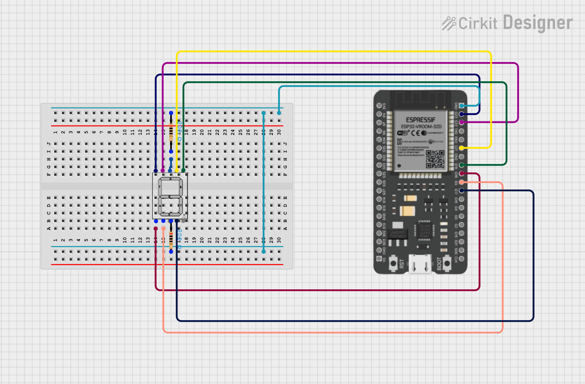

# 🔢 ESP32 with 7-Segment Display (0-9 Counter)

---

## 📖 Project Description
This project demonstrates how to **control a 7-segment display using ESP32 with MicroPython**.  
The code sequentially displays digits **0 → 9**, each digit held for **1 second**, and then loops infinitely.  

It’s a great beginner project to understand how GPIO pins control **LED segments**.

---

## ⚡ Requirements
- 🖥️ ESP32 Development Board  
- 🔌 Micro USB cable (for power + programming)  
- 🟢 7-Segment Display (Common Cathode or Common Anode)  
- 🛠️ Jumper wires  
- 🐍 [MicroPython firmware](https://micropython.org/download/esp32/) flashed on ESP32  
- 🖥️ [Thonny IDE](https://thonny.org/) (or any IDE supporting MicroPython)  

---

## 🔌 Circuit Connections

| ESP32 Pin | 7-Segment Segment |
|-----------|-------------------|
| GPIO 21   | a |
| GPIO 19   | b |
| GPIO 17   | c |
| GPIO 5    | d |
| GPIO 18   | e |
| GPIO 22   | f |
| GPIO 23   | g |

⚠️ Make sure you know whether your 7-segment is **Common Cathode (CC)** or **Common Anode (CA)**:
- For **CC**: `1 = ON`, `0 = OFF`  
- For **CA**: `0 = ON`, `1 = OFF`  

---
### Circuit Diagram

## 👨‍💻 Author

- **Name:** Kritish Mohapatra 
- **GitHub:** [Kritish Mohapatra](https://github.com/kritishmohapatra)
