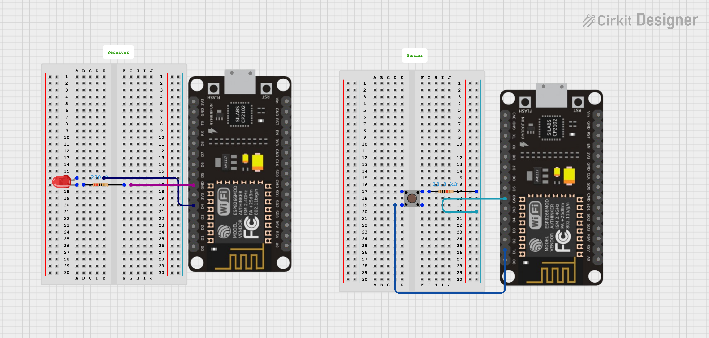

# 🔗 ESP8266 ESP-NOW Communication (Button → LED)


---

## 📖 Description
This project demonstrates **wireless communication between two ESP8266 boards using ESP-NOW**.  
- **Sender ESP8266**: Reads a push button and sends toggle commands.  
- **Receiver ESP8266**: Turns an LED **ON/OFF** based on the received command.  

This setup is fast, low-power, and does **not require Wi-Fi or an access point**.

---

## ⚡ Requirements
- 2 × ESP8266 boards (NodeMCU(ESP8266))  
- MicroPython firmware (v1.25 or newer)  
- USB cable for programming  
- Push button (for sender)  
- 2 × 10kΩ resistors (if external pull-up/pull-down required)  
- LED + 220Ω resistor (for receiver)

---

## ⚙️ Installation
1. **Flash MicroPython** to both ESP8266 boards (use `esptool.py` or NodeMCU flasher).  
2. Use **Thonny / uPyCraft / ampy** to upload:  
   - `sender.py` → Sender ESP8266  
   - `receiver.py` → Receiver ESP8266  
3. Rename files to `main.py` so they run automatically on boot.  
4. Reset both ESP boards → Press button on sender → LED toggles on receiver. ✅

---

## 📡 Setup Instructions

### 1️⃣ Get the Receiver's MAC Address
Run this code on the **Receiver ESP8266** to find its MAC address:

```python
import network
sta = network.WLAN(network.STA_IF)
sta.active(True)
print(sta.config('mac'))

 ```

## 🔌 Circuit Diagram & Connections

### 🟢 Sender ESP8266 (Button Input)
| ESP8266 Pin | Component  | Note                          |
|-------------|------------|-------------------------------|
| D1 (GPIO5)  | Button     | Active-Low (to GND) with PULL_UP |
| 3V3         | Button     | Other side of button (if using external pull-down, not needed with internal) |
| GND         | Button     | Common ground |

### 🔴 Receiver ESP8266 (LED Output)
| ESP8266 Pin | Component  | Note            |
|-------------|------------|-----------------|
| D4 (GPIO2)  | LED + 220Ω | Active-High LED |
| GND         | LED        | Common ground   |

---
### Circuit Diagram



---

## 👨‍💻 Author

- **Name:** Kritish Mohapatra 
- **GitHub:** [Kritish Mohapatra](https://github.com/kritishmohapatra)
---

## 📜 License
This project is licensed under the **MIT License** – you are free to use, modify, and distribute it.  

---
