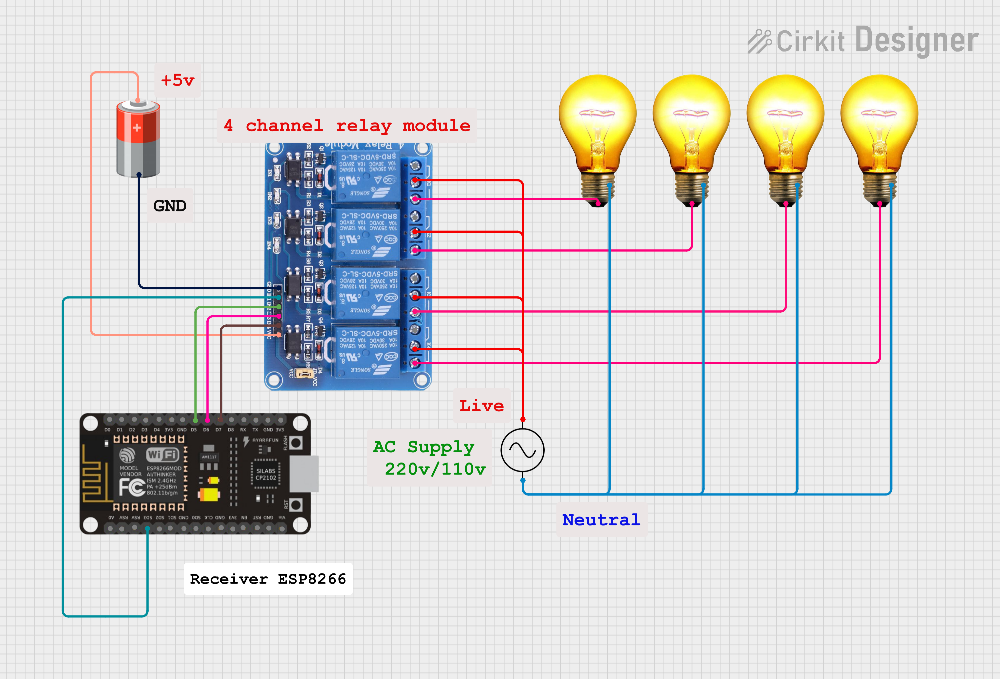

# ESP-NOW Wireless 4-Channel Relay Controller

This is a complete project for building a wireless relay control system using two **ESP8266** microcontrollers and the **ESP-NOW protocol**. The system consists of two parts: a **Sender unit** with four buttons and a **Receiver unit** with a 4-channel relay module. This setup allows for reliable, direct, and fast communication to control appliances and devices without needing a Wi-Fi router.


---

### ⚙️ How It Works

The project operates as a peer-to-peer wireless network, leveraging the ESP-NOW protocol for direct communication between the two ESP8266 boards.

1.  **ESP-NOW Initialization**: Both the sender and receiver ESP8266 boards are configured in Wi-Fi Station mode and enable the ESP-NOW protocol.
2.  **Peer Pairing**: The sender is programmed with the unique **MAC address** of the receiver. This one-to-one pairing ensures that messages are sent and received by the correct devices.
3.  **Sender Logic**: The sender continuously monitors the four push buttons. When a button is pressed, a built-in **debouncing algorithm** prevents multiple signals from being sent. It then toggles the state for the corresponding relay.
4.  **Message Transmission**: The sender forms a simple, encoded message (e.g., `"R1:1"`) and sends it wirelessly to the receiver's MAC address via ESP-NOW. This protocol is highly efficient, making it ideal for low-power applications.
5.  **Receiver Logic**: The receiver constantly listens for incoming ESP-NOW messages. Upon receiving a valid message, it parses the data to identify which relay to control and its new state (ON/OFF).
6.  **Relay Control**: The receiver's code then sets the appropriate GPIO pin, which in turn activates or deactivates the connected relay. The code is designed for **active-low** relay modules, which are common in many kits.

---

### 🧱 Components and Connections

You will need two ESP8266 boards to create both the sender and receiver.

#### Sender Unit Components

* **1x ESP8266 Development Board** 🧠
* **4x Push Buttons**
* **4x 10k resistors**
* **Breadboard & Jumper Wires**
* **Micro-USB Cable**

#### Sender Unit Circuit


The buttons are connected to the ESP8266 pins, using its internal pull-up resistors to simplify wiring. 

| Button | ESP8266 Pin | Connection Type |
| :--- | :-------- | :-------------- |
| **Button 1** | **GPIO10**| **Pin** to **GND** |
| **Button 2** | **GPIO14**| **Pin** to **GND** |
| **Button 3** | **GPIO12**| **Pin** to **GND** |
| **Button 4** | **GPIO13**| **Pin** to **GND** |

#### Receiver Unit Components

* **1x ESP8266 Development Board** 🧠
* **1x 4-Channel Relay Module** 🎛️
* **Breadboard & Jumper Wires**
* **Micro-USB Cable**

#### Receiver Unit Circuit


The relay module's input pins are directly controlled by the ESP8266's GPIO pins.

| Relay Module Pin | ESP8266 Pin | Connection Type |
| :--- | :-------- | :-------------- |
| **IN1** | **GPIO10**| Control Signal |
| **IN2** | **GPIO14**| Control Signal |
| **IN3** | **GPIO12**| Control Signal |
| **IN4** | **GPIO13**| Control Signal |
| **VCC** | **5V** or **3.3V**| Power          |
| **GND** | **GND** | Ground         |

---

### 🖥️ Software Setup

1.  **Install MicroPython Firmware**: Ensure both ESP8266 boards are running the latest MicroPython firmware.
2.  **Get MAC Address**: On the receiver ESP8266, run this simple script to find its unique MAC address.

    ```python
    import network
    sta = network.WLAN(network.STA_IF)
    sta.active(True)
    print(sta.config('mac'))
    ```
    Copy the output (e.g., `b'\xd8\xbf\xc0\x0ed\xe9'`).
3.  **Upload Sender Code**: In the sender code, paste the receiver's MAC address into the `peer` variable. Then, save and upload the sender code to the sender ESP8266.
4.  **Upload Receiver Code**: Save and upload the receiver code to the receiver ESP8266.

---

### 🚀 Usage

Once the hardware is connected and the code is uploaded to both boards, simply power them on. When you press a button on the sender unit, it will wirelessly send a command to the receiver, instantly toggling the corresponding relay.

This project is a perfect foundation for countless wireless automation tasks. Happy building!

---

### 👨‍💻 Author

-   **Name:** Kritish
-   **GitHub:** [Kritish Mohapatra](https://github.com/kritishmohapatra)