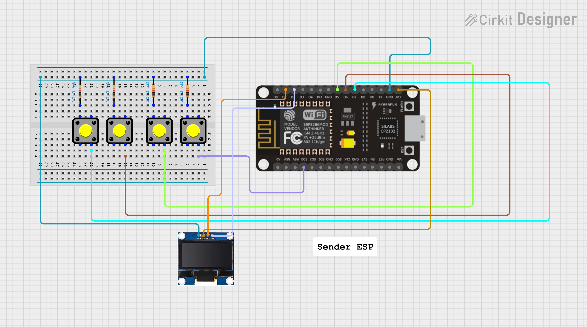
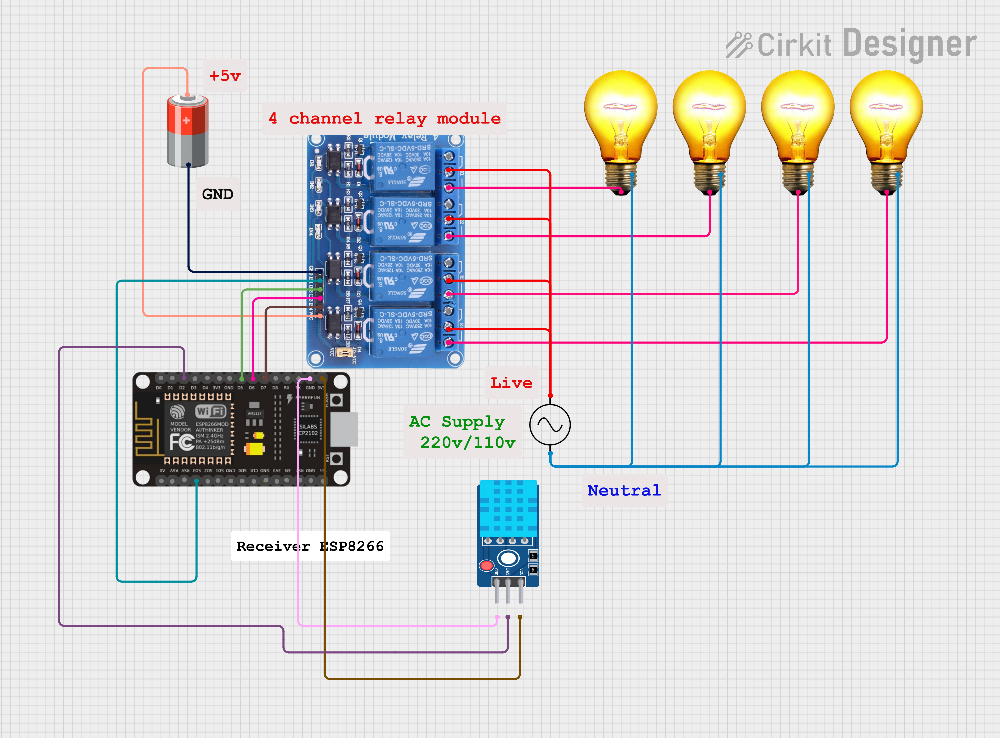

# 🏡 ESP-NOW Smart Relay & Sensor System (MicroPython)


This project demonstrates robust, bidirectional communication between two MicroPython-enabled ESP devices (ESP32/ESP8266) using ESP-NOW.

The **Sender device** acts as a control panel with physical buttons and an OLED screen to monitor status. The **Receiver device** manages a 4-channel relay module and continuously monitors environmental data using a DHT11/DHT22 sensor, sending the readings back to the Sender in real-time.

---

## ✨ Key Features

| Feature | Sender Device (Control Panel) | Receiver Device (Actuator/Sensor Hub) |
|---------|------------------------------|-------------------------------------|
| **Control** | 4 Push Buttons to toggle relays | 4-Channel Relay Module (Active-Low) |
| **Communication** | Sends R:S messages (e.g., 1:1, 4:0) | Receives relay commands and executes them |
| **Feedback** | Receives and displays Temperature/Humidity on a 0.96" I2C OLED | Reads DHT11/DHT22 sensor data every 2 seconds |
| **Network** | Adds Receiver as a peer and sends data | Saves the MAC of the last sender to reply with sensor data |

---

## 🛠️ Hardware Requirements

### Sender Board
- 1x ESP32/ESP8266 Development Board  
- 1x 0.96" I2C OLED (SSD1306 128x64)  
- 4x Tactile Push Buttons  
- 4x 10k resistors
- Jumper Wires  

### Receiver Board
- 1x ESP32/ESP8266 Development Board  
- 1x 4-Channel Relay Module (Active-Low)  
- 1x DHT11 or DHT22 Temperature/Humidity Sensor  
- Jumper Wires  

---

## 🔌 Wiring Diagram (Based on Code)


### Sender Connections (sender.py)
| Component | Function | ESP Pin |
|-----------|---------|---------|
| OLED (I2C) SCL | - | GPIO 5 |
| OLED (I2C) SDA | - | GPIO 4 |
| Button 1 (R1) | Toggle Relay 1 | GPIO 10 (PULL_UP) |
| Button 2 (R2) | Toggle Relay 2 | GPIO 14 (PULL_UP) |
| Button 3 (R3) | Toggle Relay 3 | GPIO 12 (PULL_UP) |
| Button 4 (R4) | Toggle Relay 4 | GPIO 13 (PULL_UP) |
---


### Receiver Connections (receiver.py)
| Component | Function | ESP Pin |
|-----------|---------|---------|
| Relay 1 | Control Pin | GPIO 10 |
| Relay 2 | Control Pin | GPIO 14 |
| Relay 3 | Control Pin | GPIO 12 |
| Relay 4 | Control Pin | GPIO 13 |
| DHT Sensor | Data Pin | GPIO 4 |

---

## ⚙️ Configuration and Setup

### 1. Get the Receiver's MAC Address
On the Receiver board, run the following in the MicroPython REPL:
```python
import network
sta = network.WLAN(network.STA_IF)
sta.active(True)
print(sta.config('mac'))  # prints MAC as bytes
```

### 2. Update sender.py
Replace the placeholder MAC address with the actual one:
```python
# ----------------------------
# Add Peer (Receiver MAC)
peer = b'\xd8\xbf\xc0\x0ed\xe9'  # replace with receiver MAC
esp.add_peer(peer)
```

### 3. Upload and Run
1. Upload `receiver.py` to the Receiver board and run it.  
2. Upload `sender.py` to the Sender board and run it.  

---

## 🚀 Usage

- **Control:** Press any button on the Sender to toggle the corresponding relay.  
- **Monitoring:** Receiver reads DHT sensor every 2 seconds and sends data back.  
- **Display:** Sender OLED updates with latest temperature and humidity readings.  

### Message Protocol

- **Sender → Receiver (Relay Control):** `[RelayNumber]:[State]` (e.g., `1:1` → Relay 1 ON)  
- **Receiver → Sender (Sensor Data):** `T:[Temperature],H:[Humidity]` (e.g., `T:25,H:60`)  

---

### 👨‍💻 Author

-   **Name:** Kritish
-   **GitHub:** [Kritish Mohapatra](https://github.com/kritishmohapatra)