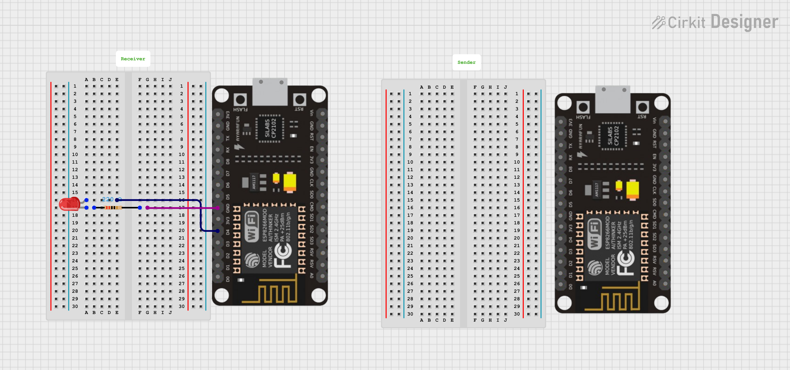

# 💡 ESP8266 ESP-NOW LED Control


This project demonstrates how to use **ESP-NOW** protocol to wirelessly control an LED connected to another ESP8266 board.  
One board acts as a **Sender** (transmitter) and the other as a **Receiver**.


## 📦 Requirements

- 2 × ESP8266 boards (NodeMCU / Wemos D1 Mini)
- 1 × LED
- 1 × 220Ω resistor
- Jumper wires
- Breadboard (optional)
- MicroPython firmware installed on both ESP8266 boards

---

## ⚙️ Installation

1. **Flash MicroPython** firmware on both ESP8266 boards.  
   Download firmware from: [MicroPython Downloads](https://micropython.org/download/ESP8266/)

2. **Upload the following scripts**:
   - `receiver.py` → Receiver board
   - `sender.py` → Sender board

---

## 📡 Setup Instructions

### 1️⃣ Get the Receiver's MAC Address
Run this code on the **Receiver ESP8266** to find its MAC address:

```python
import network
sta = network.WLAN(network.STA_IF)
sta.active(True)
print(sta.config('mac'))

 ```


## ⚡ Circuit Diagram

### Receiver ESP8266 Connection
| ESP8266 Pin | Component |
|-------------|-----------|
| GPIO2 (D4)  | LED (+)   |
| GND         | LED (−) via 220Ω resistor |

---

### Diagram



---
**Explanation:**
- **GPIO2 (D4)** → Controls the LED.
- **220Ω Resistor** → Limits current to safe levels (~15 mA).
- **GND** → Completes the LED circuit.
- The LED will glow when **GPIO2 outputs HIGH** and turn off when **LOW**.


## ▶️ Running the Project

1. Power up both ESP8266 boards.
2. Run `receiver.py` on the **Receiver** board.
3. Run `sender.py` on the **Sender** board.
4. Enter `1` in the sender's terminal → **LED turns ON**.
5. Enter `0` in the sender's terminal → **LED turns OFF**.

---

## 👨‍💻 Author

- **Name:** Kritish Mohapatra 
- **GitHub:** [Kritish Mohapatra](https://github.com/kritishmohapatra)
