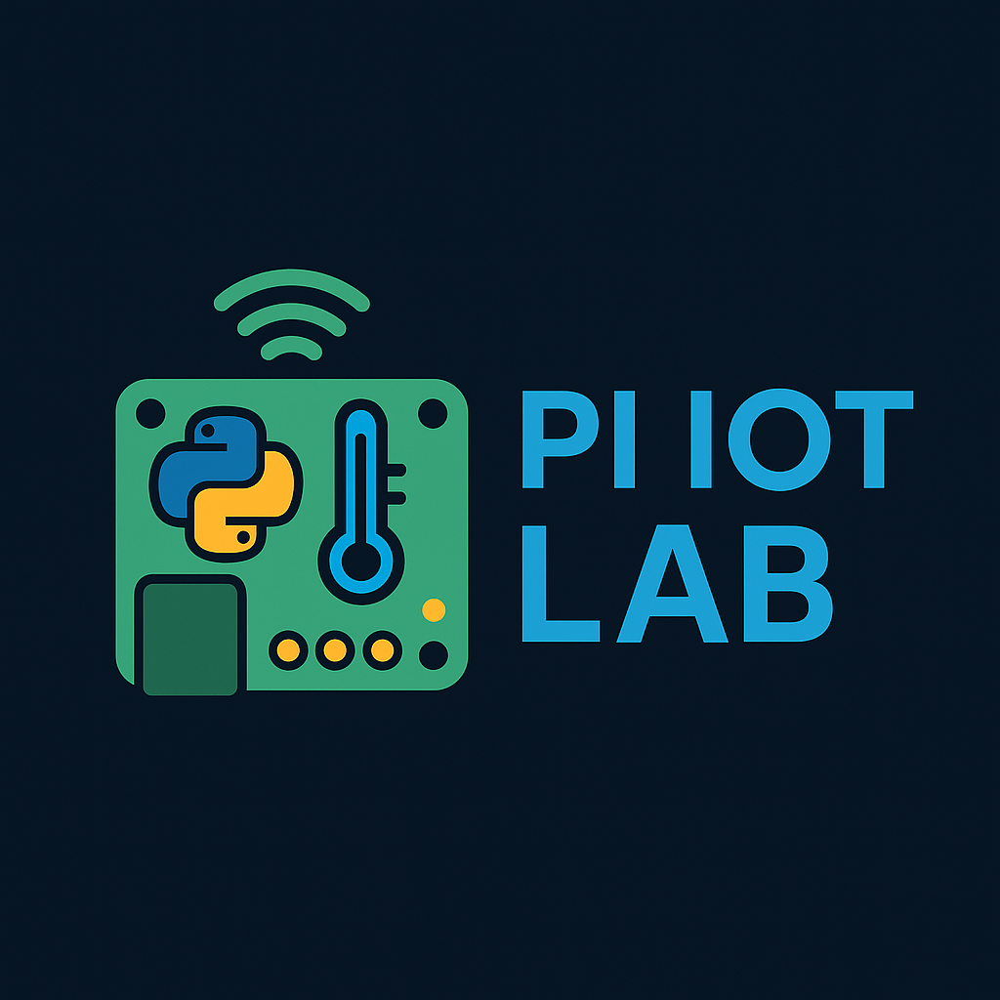

# Pi IoT Lab

Welcome to **Pi IoT Lab** – a curated collection of Raspberry Pi projects using Python, MicroPython, sensors, and IoT technology.

## 🚀 Projects Included

- 🌡️ Temperature Monitor (DHT11)
- 🔥 Gas Detector (MQ4)
- 📊 Live Web Dashboard (Flask/MicroPython)
- ⏰ Medicine Reminder
- 🔔 Buzzer + Alert System

## 🛠️ Tech Stack

- Raspberry Pi (Zero/3/4)
- MicroPython / Python
- Sensors (DHT11, MQ4, IR, Ultrasonic, etc.)
- Web Interfaces (Flask, HTML/CSS)
- GitHub Actions (coming soon!)

## 🧩 Badge

---

🔗 **Connect**: Follow for updates and more Pi-tastic projects! 🚀
