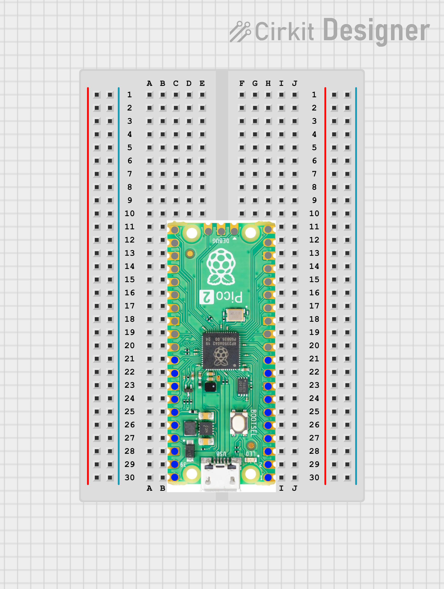

# 💡 Raspberry Pi Pico 2 W - LED Blink with MicroPython

---

## 📖 Project Description

This is the **first step into MicroPython with Raspberry Pi Pico 2 W**.  
We blink the onboard LED using MicroPython to understand how to control GPIO pins.  

The LED will **turn ON for 1 second** and **OFF for 1 second**, continuously.

---

## ⚡ Requirements

- 🖥️ A computer (Windows/Linux/Mac)
- 🔌 [Thonny IDE](https://thonny.org/) installed
- 🛠️ MicroPython firmware for **Raspberry Pi Pico 2 W**
- 📟 Raspberry Pi Pico 2 W board
- 🔴 Onboard LED (already available on Pico)

---

## 📥 Installation

1. Download and install **Thonny IDE**.
2. Flash the **MicroPython firmware** on Raspberry Pi Pico 2 W.  
   - Go to [Raspberry Pi Documentation](https://www.raspberrypi.com/documentation/microcontrollers/raspberry-pi-pico.html)  
   - Download the `.uf2` MicroPython firmware.  
   - Hold **BOOTSEL** button → plug Pico into USB → drag & drop the `.uf2` file.
3. Open **Thonny IDE**, select **Interpreter → MicroPython (Raspberry Pi Pico)**.
4. Copy the following code and save it as `main.py` on the Pico.

---

### Circuit Diagram

---

## 👨‍💻 Author

- **Name:** Kritish Mohapatra 
- **GitHub:** [Kritish Mohapatra](https://github.com/kritishmohapatra)
---

## 📜 License
This project is licensed under the **MIT License** – you are free to use, modify, and distribute it.  

---