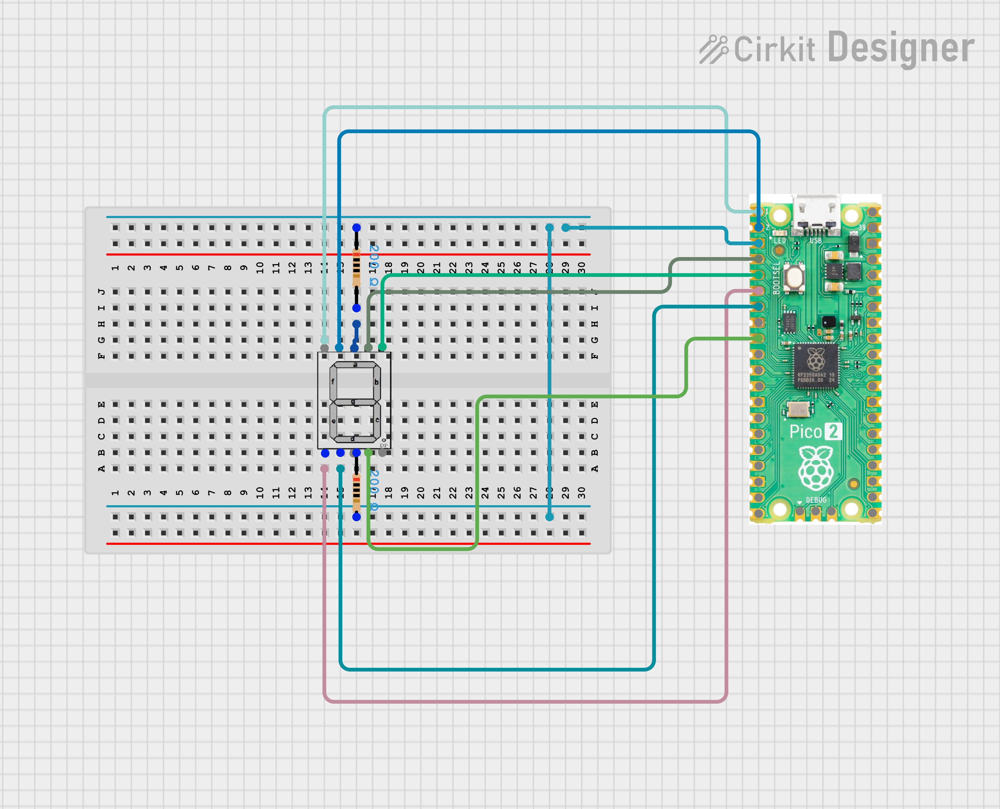

# 🔢 Raspberry Pi Pico 2 W - 7 Segment Display (Input Based)

---

## 📖 Project Description
This project demonstrates how to **control a 7-segment display using Raspberry Pi Pico 2 W with MicroPython**.  
The program takes a **user input (0–9)** and displays the corresponding digit on the 7-segment display.  

It’s an excellent project to understand **GPIO control** and **basic display interfacing**.

---

## ⚡ Requirements
- 🖥️ Raspberry Pi Pico 2 W  
- 🔌 Micro USB cable  
- 🔢 7-Segment Display (Common Cathode or Anode)  
- 🛠️ Jumper wires  
- 🐍 [MicroPython firmware](https://micropython.org/download/rp2-pico-w/)  
- 🖥️ [Thonny IDE](https://thonny.org/)  

---

## 🔌 Circuit Connections

| Pico 2 W Pin | 7-Segment Segment |
|--------------|--------------------|
| GP2          | a |
| GP3          | b |
| GP6          | c |
| GP5          | d |
| GP4          | e |
| GP1          | f |
| GP0          | g |

⚠️ Check if your 7-segment is **Common Cathode (CC)** or **Common Anode (CA)**:  
- CC → `1 = ON`, `0 = OFF`  
- CA → `0 = ON`, `1 = OFF`  

---

### Circuit Diagram

## 👨‍💻 Author

- **Name:** Kritish Mohapatra 
- **GitHub:** [Kritish Mohapatra](https://github.com/kritishmohapatra)
